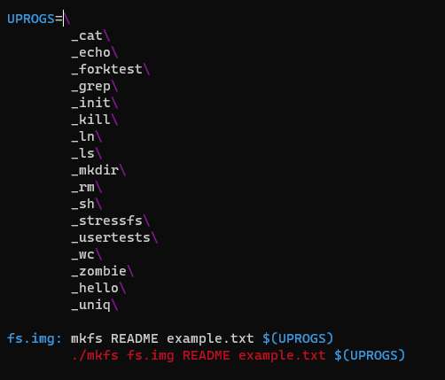

# Implementing uniq on xv6 as a User Program

## Overview

This project aims to implement a simplified version of the uniq command in the xv6 operating system as a user program. The uniq command is commonly used to remove adjacent duplicate lines from a file. Here are the steps and details of the implementation:

### Steps:

#### 1. Prepare Input File

Create a sample input file named `demo.txt` with the following content:

```
I understand the Operating system.
I understand the Operating system.
I understand the Operating system.
I love to work on OS.
I love to work on OS.
Thanks xv6.
```

2. created a file called uniq.c which contains the logic for removing the adjacent duplicate line from a file. Please find file in the attached documents. The code is written using extensive c libraries.

upon executing this file it produces desirable results as it is shown in the below screenshot.


3. Later, I have decided to run this in the qemu environment, I have created a fie called example.txt which holds same information as demo.txt. I have included both example.txt and uniq.c(modified verion which supports xv6, **THE LOGIC HOLDS SAME**) in Makefile.png as you can see below. I'm attaching new uniq.c code and example.txt.


.png>)


4. After running commands "make" and "make qemu", I have successfully entered the qemu environment and run ls command to confirm that I have all the required files. As you can see below, I have all necessary files.


5. After running the command "uniq example.txt", we get all the adjacent duplicate lines removed.


Similarly, The output for below commands

\*uniq -c example.txt - This returns the count of duplicates preceded by each line.


\*uniq -i example.txt - This removes adjacent duplicate lines irrespective of case insensitivity.


\*uniq -d example.txt - This returns only duplicate lines.

