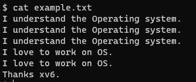

# Implementing uniq on xv6 as a User Program

## Overview

This project aims to implement a simplified version of the uniq command in the xv6 operating system as a user program. The uniq command is commonly used to remove adjacent duplicate lines from a file. Here are the steps and details of the implementation:

### Steps:

#### 1. Prepare Input File

Create a sample input file named `demo.txt` with the following content:

```shell
I understand the Operating system.
I understand the Operating system.
I understand the Operating system.
I love to work on OS.
I love to work on OS.
Thanks xv6.
```

#### 2. Create `uniq.c` Program

Develop a C program named `uniq.c` that contains the logic for removing adjacent duplicate lines from a file. The code has been written with extensive C libraries to handle file operations and line comparison.


#### 3. Modify `uniq.c` for xv6 Compatibility

Modify `uniq.c` to make it compatible with the xv6 operating system while keeping the logic the same.



.png>)


#### 4. Prepare Environment

In preparation for running the program in the xv6 environment, create a file named `example.txt` with the same content as `demo.txt`. Update the `Makefile` to include both `example.txt` and the modified `uniq.c` to ensure they are included in the xv6 environment.

This is how it should look like after using the `ls` command in xv6 environment.


#### 5. Enter xv6 Environment

Compile and enter the xv6 environment using the following commands:

```shell
make
make qemu
```

#### 6. Execute uniq Program

Execute the uniq program in the xv6 environment using the following command:

```shell
uniq example.txt
```


### Results:

Upon running the `uniq` program, the adjacent duplicate lines are removed from the input file, resulting in a clean and unique list of lines. The program also supports additional options, such as:

Similarly, The output for below commands

- uniq -c example.txt - Returns the count of duplicates preceded by each line.
  

- uniq -i example.txt - Removes adjacent duplicate lines irrespective of case sensitivity.
  

- uniq -d example.txt - Returns only duplicate lines.
  

### Conclusion

This project successfully demonstrates the implementation of the `uniq` command as a user program in the xv6 operating system. It provides a useful tool for managing and processing text files within the xv6 environment.
